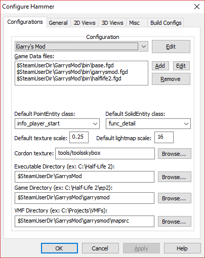
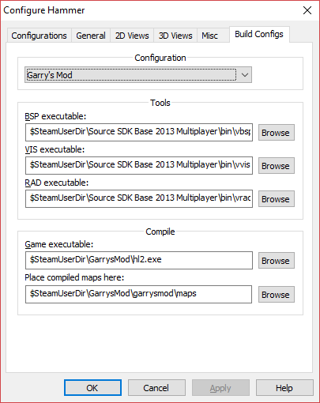
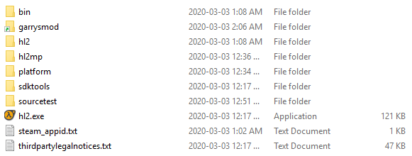
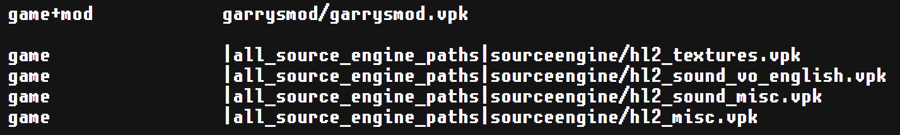
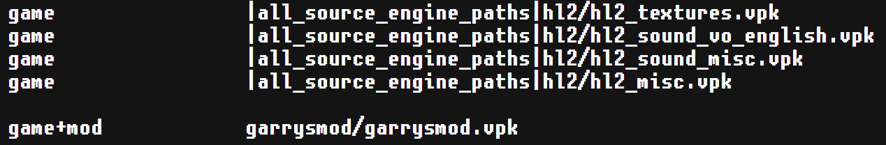
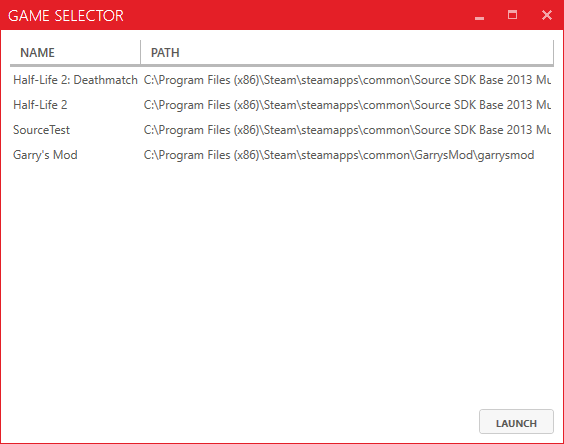
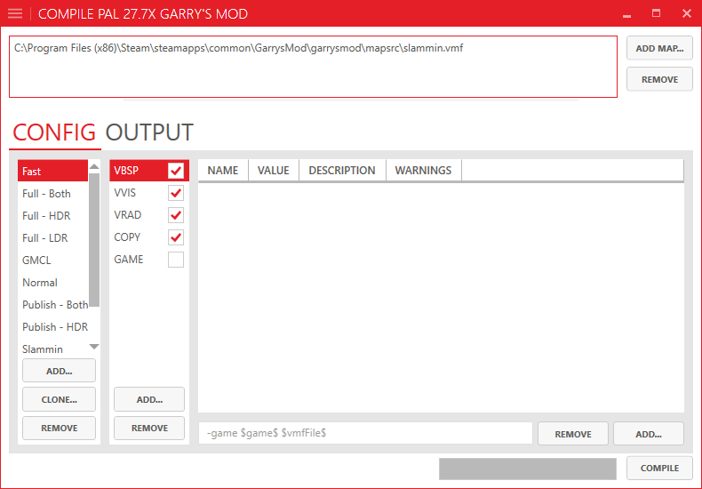
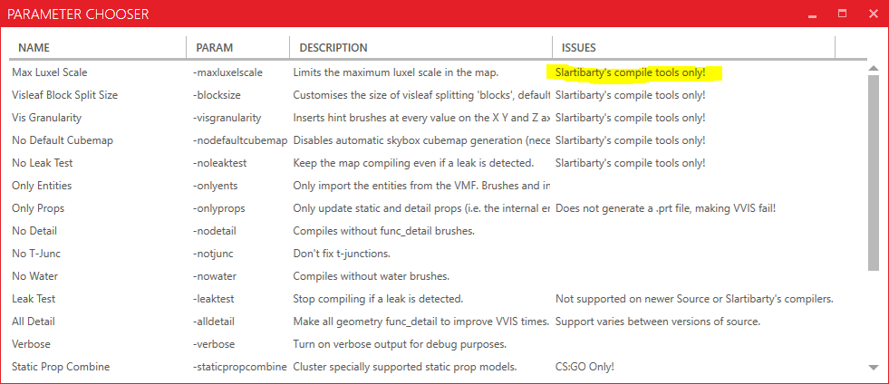

# Slammin' Source Tools for Garry's Mod

## I. Preparation

First you'll need to make sure you have everything downloaded:

### a) Required

+ [7-Zip](https://www.7-zip.org/download.html)
+ [Link Shell Extension](https://schinagl.priv.at/nt/hardlinkshellext/linkshellextension.html)
+ [SlamminToolsMP-1.5.7z](https://drive.google.com/drive/folders/17pQY8wDkednZi0kMZOSpAtNBNmFWm6GJ)
+ Source SDK 2013 Multiplayer (available in your Steam Library in the `Tools` category)

### b) Optional

These are only needed if you plan on following Section IV.

+ [CompilePal](https://github.com/ruarai/CompilePal/releases)
+ [CompilePal Slammin' Build Parameters](https://drive.google.com/file/d/1RKbnrKgNrEjScoxFHKVnM_c2VKCMj694/view)

## II. Install Slammin' Source Tools

Using 7-Zip, Extract the contents of the `SlamminToolsMP-1.5.7z` archive you downloaded to your Source SDK 2013 Multiplayer bin folder (`C:\Program Files (x86)\Steam\steamapps\common\Source SDK Base 2013 Multiplayer\bin` for a standard installation).

You'll be asked to replace the files you're trying to copy over, allow it. This will replace Valve's build tools that come shipped with the SDK.

Congratulations! You've installed the Slammin' Source Tools. Now up until this point, you haven't touched Garry's Mod yet. That's where the next section comes in.

## III. Garry's Mod + Source SDK 2013 Multiplayer

This is the trickiest section of the guide. Make sure to follow as closely as possible.

### a) Hammer Config

Fire up the newly replaced `hammer.exe` in the bin folder mentioned in the last section (when you extracted the Slammin' Source Tools).

Click on `Tools > Options...`, create a new config under the `Configurations` tab called `Garry's Mod`, and use the following config:

Now go to the `Build Configs` tab and use the following config:

Now Garry's Mod is set up with the Slammin' Hammer Editor, however there's still a few things you need to do first in order for it to work properly.

### b) Symbolic Links

**NOTE**: Feel free to skip this section if you're already familiar with symbolic links, and have Link Shell Extension installed.

To put it briefly, a symbolic link is basically a file system object that points to another file system object. In the scope of this guide, this will effectively let you trick the SDK into thinking Garry's Mod (`garrysmod`) is just another mod like `hl2` or `hl2mp` are.

If you haven't installed the Link Shell Extension yet, now would be a good time. Make sure to choose the correct version depending on whether your OS is 32 or 64 bit. You may also need to install the Visual C++ Redistributable package, which is available from the same site. 

Link Shell Extension allows you to create symbolic links from the File Explorer in Windows. You technically don't need to install this extension if you know how to create links in the command prompt, but it's still worth installing if you manage links regularly.

### c) Linking Garry's Mod

To trick the SDK to include Garry's Mod as another mod, you need to link the `garrysmod` folder from your Garry's Mod installation folder (`C:\Program Files (x86)\Steam\steamapps\common\GarrysMod` for a standard installation) to your Source SDK 2013 Mutliplayer installation folder (`C:\Program Files (x86)\Steam\steamapps\common\Source SDK Base 2013 Multiplayer` for a standard installation).

Using the Link Shell Extension, this can be done by selecting the `garrysmod` folder, right click dragging them to your Source SDK 2013 Multiplayer installation folder, and selecting `Drop Here... > Symbolic Link`.

Once the symbolic links have been created, your Source SDK 2013 Multiplayer installation folder should look something like this:

Note the small green arrows indicating that the `garrysmod` folder is a symbolic link.

### d) Modifying gameinfo.txt

If you launched Hammer right now to tried and make a map, you'll probably notice the 2D and 3D views don't look quite right. This is because the `gameinfo.txt` file in your `garrysmod` folder isn't referencing the required content from the `hl2` folder. Normally Garry's Mod uses the `sourceengine` folder to this effect, but since you're using Soruce SDK 2013 Multiplayer you need to modify the `gameinfo.txt` in `garrysmod` to use those instead.

Open up the `gameinfo.txt` file in your `garrysmod` folder with your favourite text editor.

Sroll down to the `SearchPaths` section of the file. As the comments would suggest (denoted with a `//`), anything we change here doesn't really affect Garry's Mod since it uses a separate system for mounting game content.

With that in mind, go ahead and change this block of text:

to this:

Basically what changed here is you're moving line that mounts `garrysmod.vpk` below the `hl2_*.vpk` content, and changing the lines that mount `hl2_*.vpk` content to use `hl2/` instead of `sourceengine/`.

## IV. CompilePal (Optional)

This section is optional, but highly recommended. You can skip to Section V if you don't want CompilePal.

### a) Preamble

CompilePal is a dedicated tool to compile your maps. It should automatically source your Soruce SDK 2013 Multiplayer, which means in this guide the `Garry's Mod` profile we created in Hammer earlier should also be detected.

If you haven't downloaded CompilePal yet, grab it and the custom Slammin' build parameters from Section I.b.

### b) Installation

Extract CompilePal wherever you prefer, and then extract the `Parameters` folder from `compilepal_parameters_26.04.2019.zip` to whever you extrated CompilePal to. Replace any files or folders if asked to.

### c) Usage

Fire up CompilePal. You should be greeted by this dialog:

For this guide, you'll want to use the Garry's Mod profile we made earlier.

You should now be greeted by the main window:

If you go to add options to `VBSP`, `VVIS` or `VRAD`, you should see a lot of different build options to choose from, especially with the custom Slammin' build parameters you added:

Anything that is specific to the custom compilers will have the highlighted text in the `Issues` column.

## V. Closing Thoughts

Congratulations! If you've been following the guide up until this point, you should've successfully integrated the Slammin' Source Tools with Garry's Mod.

### a) Default HDR

One important thing to note is the custom VRAD compiler will only compile for HDR by default. You can force it to use LDR or compile for both by adding the `-ldr` or `-both` options respectively.

### b) Special Thanks

Special thanks to the following people:

+ [Slartibarty](http://web.archive.org/web/20190611221800/https://forum.facepunch.com/dev/bvenk/Slammin-Source-map-tools/) for making these awesome, custom Source build tools.

+ Knockout user [yoshimario2000](https://knockout.chat/thread/992/1#post-87752) for the custom Slammin' build parameters for CompilePal.

+ MrMuffinz for telling me about Slammin' Source Tools.